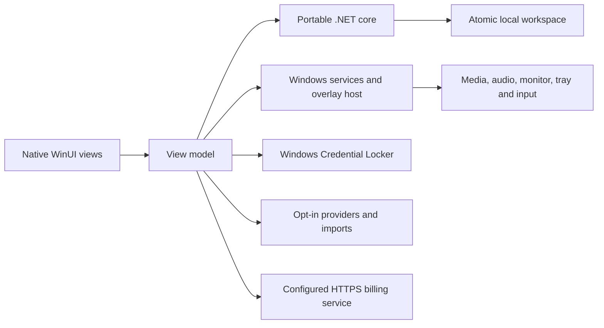

<p align="center">
  
</p>

<h1 align="center">Notchling</h1>

<p align="center"><strong>A dynamic island for your desktop.</strong></p>

<p align="center">A native Windows notch for media, focus, notes, and everyday controls. Linux support is planned.</p>

<p align="center">
  <a href="https://github.com/Sury2797/Notchling/releases/download/notchling-evaluation-0.3.4/Notchling-0.3.4-windows-x64-evaluation-setup.exe"></a>
  <a href="https://github.com/Sury2797/Notchling/releases/download/notchling-evaluation-0.3.4/Notchling-0.3.4-windows-x64-evaluation-setup.exe"></a>
  <a href="#platform-targets"></a>
</p>

<p align="center">Windows buttons download the same <a href="https://github.com/Sury2797/Notchling/releases/tag/notchling-evaluation-0.3.4">v0.3.4 evaluation installer</a> · 8.9 MB · unsigned · missing shared runtimes download during setup.</p>

<p align="center">
  <a href="https://github.com/Sury2797/Notchling/actions/runs/37944357692"></a>
  <a href="https://github.com/Sury2797/Notchling/actions/workflows/build.yml"></a>
  <a href="https://github.com/Sury2797/Notchling/actions/workflows/release.yml"></a>
</p>

<p align="center">
  <a href="#the-experience">Experience</a> ·
  <a href="#free-and-premium">Access</a> ·
  <a href="#try-notchling">Downloads</a> ·
  <a href="#build-and-release-with-github-actions">CI / CD</a> ·
  <a href="#development">Development</a> ·
  <a href="#documentation">Documentation</a>
</p>

Notchling is a native desktop notch inspired by Dynamic Island. Its compact strip at the top of your display expands into the panel you need: change a track, start a focus session, capture a thought, reach a file, or check your system. Live activities show timers and reminders. Move between tools with the dock, pin a panel while you work, and let it collapse when you’re finished.

The **Pixel Dragon** is Notchling’s app icon. The Windows application uses **C#, WinUI 3, and Windows App SDK**, with native services behind a portable .NET core. Windows 10 and Windows 11 are equal release targets; a Linux desktop application follows later.

## Current status

**v0.3.4 public testing · Windows cloud qualification passed.** The current source unlocks **all 21 catalog panels for everyone**, with no subscription or purchase required. This includes the extended media, focus, notes, clipboard and system controls. External connections still need compatible players, your own provider setup or selected files. Purchasing is paused.

The download buttons install [v0.3.4](https://github.com/Sury2797/Notchling/releases/tag/notchling-evaluation-0.3.4), with all tools unlocked. [The exact release run](https://github.com/Sury2797/Notchling/actions/runs/37944357692) passed **345 regression checks per Windows/Linux host**, native WinUI build and installation, all 21 panels, hover/leave, Settings alignment and drafts, eight connection states, notes/Awake controls, preview, evaluation update guidance, existing-instance reopening and uninstall on two Windows cloud hosts. The published EXE's size, Windows PE header and SHA-256 were independently verified.

This refinement targets the reported sticky hover state, oversized connection buttons, media metadata/artwork and uneven layouts. It uses shape-aware pointer checks, bounded editing leases, rendering-frame shell transitions, retained media controls and compact responsive settings forms. **Settings → Connection status** checks each supported source and distinguishes setup needed, successful reads and failures. Smoothness and consumer Windows 10/11 behavior still require measured hardware results.

The [validation notes](docs/validation-notes.md) record the exact revision, measurements, and test limits. Consumer Windows 10/11 qualification, publisher signing, and production commercial configuration remain launch requirements.

| Area | Current source | Before a stable paid release |
| --- | --- | --- |
| Desktop | Native Windows app; all catalog tools unlocked for public testing; adaptive panels and reduced motion | Independent Windows 10/11 interaction, accessibility, and hardware profiling |
| Distribution | Single evaluation setup EXE; installed public-testing catalog and controls verified on two Windows cloud hosts; automatic shared prerequisites | Publisher certificate and consumer Windows 10/11 clean install/upgrade/update qualification |
| Access and subscriptions | Public testing is free for everyone; signed paid-entitlement validation retained; checkout paused | Owner decision to restore Free/Premium, production domain, Stripe, email delivery, customer policies, and sandbox acceptance |
| Linux | Portable core and automated checks | Native interface and Linux operating-system adapters |

The [release checklist](docs/release-readiness.md) tracks acceptance. Build results establish compilation and packaging; measured responsiveness and native usability need their own evidence.

### In development: v0.4.1 refinement

The current source adds the following changes. **v0.3.4 remains the qualified download above until the new installers pass their own checks.**

| Detail | Candidate behavior |
| --- | --- |
| Icons and compact state | 48 bundled vector control icons with consistent strokes; approved Pixel Dragon at idle; source logos during playback; softer card feedback |
| Media identity | Separate source badge and track artwork. YouTube, YouTube Music, Spotify and other recognized players use source logos. A generic Chrome/Edge/Firefox session keeps its browser identity until you explicitly choose a provider for that track |
| Motion | Short, interruptible geometry transitions; content fades and small translations without scaling text; reduced motion settles immediately |
| Layout and feedback | Responsive reporting cards and Settings actions, retained drafts, and short feedback tied to its originating tool |
| Updates | Read-only evaluation release checks, a quiet compact indicator and notification history; optional daily checks are off by default. Signed updates expose explicit Install, progress and Cancel controls |
| Architecture | Native x64, x86 and ARM64 build/package paths; publication waits for all four installed-app jobs, including a native Windows 11 ARM64 host |

A browser's Windows media session often omits its website. Selecting **YouTube** in the Media source menu gives the current track that logo without reading browser history or guessing from its title. The choice clears when the track or native session changes. Album artwork remains in the expanded player.

Candidate qualification and the remaining device checks are recorded in [validation](docs/validation-notes.md) and [flaws.md](flaws.md). This source work does not establish native x86/ARM64 release success, consumer Windows 10 compatibility or measured frame pacing.

The preceding v0.4.0 candidate was withheld after actual installed-app checks exposed shared WinUI icon-geometry ownership and an x86 Setup runtime-compiler failure. v0.4.1 gives every icon its own geometry and prepares the Setup resource helper at build time; the full matrix must pass again before publication.

## The experience

### Small when idle. Useful when open.

Hover over the notch to open it, choose a tool from the separate dock, and leave to collapse. Pinning keeps your current panel open. Placement settings select the monitor and offsets; fullscreen suppression keeps the overlay out of the way when configured.

Recent text input, open dialogs, and active control manipulation defer passive navigation and temporary activities. A previously focused editor does not keep an unpinned island open indefinitely. Timers and reminders use a bounded activity queue; notification history keeps recent deliveries within reach.

In the v0.4.1 source, normal footer feedback expires after eight seconds and follows only its originating tool. Unsaved-work guidance stays visible. Update notices go to history and the compact indicator without replacing the panel you are editing.

| Action | Control |
| --- | --- |
| Open or collapse | `Ctrl + Shift + Space` |
| Open Settings while the app has focus | `F2` |
| Collapse the panel | `Esc`, when no dialog is open |
| Keep a panel open | Pin toggle |
| Move between controls | `Tab` / `Shift + Tab` |
| Show the hidden app | Tray → **Open Notchling** |
| Save and exit | Tray → **Quit Notchling** |

### Native by design

WinUI owns controls and content composition. Windows services provide media sessions, audio volume, monitor placement, keyboard shortcuts, clipboard access, and power requests. Views are created on demand, background work is cancellable, and stale responses cannot overwrite newer selections.

Panel transitions respect reduced motion and Windows animation preferences. The architecture limits avoidable work; CPU, memory, input latency, and rendered frame pacing remain measurements to collect on Windows hardware.

## What’s inside

The catalog contains **Home and 20 tools**, plus Settings and an All tools index. The v0.3.4 public-testing release enables the entire catalog in both Release and Debug. Provider setup and native capabilities determine which data and controls are available; unlocking a tool does not fabricate a connection.

| Purpose | Tools | Details |
| --- | --- | --- |
| Listen | Media | Track information, artwork, transport, supported seeking, and system volume |
| Focus | Focus, Sounds, Awake | Pomodoro, countdown, stopwatch/laps, hydration reminders, local ambient sound, and explicit sleep inhibition |
| Capture | Notes, Scratchpad, Clipboard | Local text and optional, bounded clipboard history |
| Reach | Shelf, Files, Links, Emoji | File references, local shortcuts, saved web links, and the Windows emoji picker |
| Inspect | Home, System, Servers, Screen time, Convert | Available desktop summaries, CPU/memory/battery, listening TCP ports, session activity, and unit conversion |
| Connect | Revenue, Analytics, Coding, Calendar, Weather | Optional account reports, endpoint metrics, selected imports, and configured forecasts |

The [module guide](docs/modules-and-connections.md) describes each tool’s behavior, limits, and unavailable states.

### Connections with clear boundaries

Local tools work without an application account during public testing. Connected tools use providers or files you explicitly configure. **Check connections** reads your saved setup; missing sources are explained rather than replaced with sample data. Saving a credential is not proof that a provider request succeeded.

| Connection | Supported behavior |
| --- | --- |
| Media | Windows system media sessions; title, artist, source and artwork follow the selected player’s available metadata; unsupported commands remain disabled |
| Revenue | Read-only Stripe captured payments after refunds; payment revenue, **not subscription MRR** |
| Analytics | Authenticated, user-configured HTTPS endpoint with a documented JSON contract |
| Coding | Selected Claude or Codex JSONL imports; imported usage without home-directory scanning or inferred account quotas |
| Calendar | Local `.ics` import, supported recurrence/time-zone rules, and reminders; account synchronization is future work |
| Weather | Tool access is unlocked; real forecasts require the owner’s configured licensed proxy and an authenticated service account. That service is not configured yet |

Polar, Dodo, and AdSense reporting are not connected. Built-in analytics OAuth, calendar account sync, and cloud workspace sync are not implemented. See the [provider contracts](src/Notch.Core/Providers/README.md) for schemas, attribution, and setup. Third-party accounts, service charges, and availability are separate from Notchling’s testing access or any future subscription.

The v0.4.1 Media source menu separates provider identity from thumbnails. Known sources use bundled logos; other installed players retain their Windows-supplied icon. Browser choices are explicit, temporary labels, and do not create a new playback connection or change the active Windows media session.

## Free and Premium

**Public testing: all tools are free for everyone.** No owner-only unlock, paid account or fake Premium proof is required. Checkout is paused, and testing access does not automatically become a subscription. The published v0.3.4 installer uses this policy.

The intended later commercial model remains a deliberately light **Free** edition and **Premium for US$2 per month**. The following split is a future plan, not an active paywall during public testing:

| | Free | Premium |
| --- | --- | --- |
| Price | **US$0** | **US$2/month**, billed monthly |
| Compact notch and keyboard navigation | Included | Included |
| Media | Play/pause, previous, next | Full panel and supported playback controls |
| Focus | One Pomodoro timer | Pomodoro, countdowns, stopwatch/laps, and hydration |
| Capture | One local scratchpad | Scratchpad, notes, shelf, file shortcuts, and links |
| Extended tools | — | Clipboard history, system tools, conversions, emoji, sounds, and Awake |
| Connected dashboards | — | Supported revenue, analytics, coding, calendar, and weather connections |
| Privacy, reduced motion, and workspace recovery/export | Included | Included |

**Billing is prepared, not live.** The testing phase grants tool access separately from paid subscription verification. Actual Premium status still requires a verified, device-bound signed entitlement; the testing phase does not create or alter one. The separate billing service retains email verification, hosted Stripe checkout, subscription management and purchase restoration for a later commercial release. Production credentials and approved customer policies must be configured before charging.

The planned paid policy is monthly renewal, cancellation of future renewals and access through the verified paid period. Expiry preserves local material and recovery/export. No annual or lifetime plan, AI credits, cloud synchronization or unlimited storage is included. Read [pricing](docs/pricing.md), [product terms](docs/product-terms.md) and [billing setup](docs/billing.md) for the current testing phase and future commercial boundaries.

## Your data and controls

Notchling’s workspace stays on your device. Optional connections make requests for their configured purpose; the app has no cloud workspace synchronization service or app analytics SDK in this checkout.

- **Workspace:** notes, scratchpad, reminders, links, and file references use local plaintext JSON. Saves are atomic and bounded; failed final saves offer retry, export, or explicit discard.
- **Credentials:** provider secrets and subscription login/proof state use Windows Credential Locker, separately from workspace JSON.
- **Clipboard:** off by default; when enabled, up to 50 text entries remain in memory and clear on disable or exit.
- **Imports:** calendar and coding data come from files you choose.
- **Recovery:** Settings provides export, validated restore, corrupt-file preservation/recovery, and note-deletion undo.
- **Updates in v0.4.1 source:** explicit checks read official GitHub release metadata. Optional daily checks are off by default, run only while the app is open, and never install an update automatically.

The compatible data folder remains **`%LOCALAPPDATA%\Notch`**. The branding update retains that path and existing vault identities, so it does not create an empty workspace or discard saved connections. Export before making a manual backup; quit the app before copying the data folder. Vault credentials are not part of that folder backup.

Workspace limits include a 10 MB serialized file ceiling, bounded text, and up to 100 entries per notes/reminders/shelf/links collection. Oversized edits are rejected visibly instead of being truncated. Secure your device and backups: local JSON and exports are plaintext. See [Privacy](docs/privacy.md) for requests, updates, and customer controls.

## Try Notchling

### Choose your download

**On Windows 10 or 11 x64, choose Setup `.exe`.** One installer serves both versions; you do not need to choose a different application format or install developer tools.

| Your device or package | What to choose | Where to get it |
| --- | --- | --- |
| Windows 11 x64 | **Setup `.exe` — recommended** | [Download the evaluation installer](https://github.com/Sury2797/Notchling/releases/download/notchling-evaluation-0.3.4/Notchling-0.3.4-windows-x64-evaluation-setup.exe) |
| Windows 10 22H2 x64, build 19045 | **The same Setup `.exe`** | [Download the evaluation installer](https://github.com/Sury2797/Notchling/releases/download/notchling-evaluation-0.3.4/Notchling-0.3.4-windows-x64-evaluation-setup.exe) |
| Windows app-only folder | Advanced evaluation with compatible shared runtimes already installed; keep all files together | `notchling-windows-x64-app-only` in [successful build runs](https://github.com/Sury2797/Notchling/actions/workflows/build.yml) |
| Windows `.msi` / `.msix` | No package currently produced; use Setup `.exe` | — |
| Linux `.AppImage` / `.deb` / `.rpm` | Native application planned; no Linux app download yet | [Linux roadmap](docs/product-roadmap.md) |
| Windows ARM64 / x86 | Native builds configured in v0.4.1 source; public installers await qualification | [Candidate status](#in-development-v041-refinement) |
| macOS `.app` / `.dmg` | No application build configured | — |

The app-only folder is an advanced distribution of the same Windows app, not a self-contained single executable. A Linux core test result does not provide a Linux desktop application.

### Evaluation builds

1. [Download Notchling Setup for Windows](https://github.com/Sury2797/Notchling/releases/download/notchling-evaluation-0.3.4/Notchling-0.3.4-windows-x64-evaluation-setup.exe). This direct `.exe` download requires no GitHub sign-in or ZIP extraction.
2. Run **`Notchling-0.3.4-windows-x64-evaluation-setup.exe`**.
3. Open **Notchling** from the Start menu.

Evaluation releases appear in [Releases](https://github.com/Sury2797/Notchling/releases). Development snapshots also appear as **`notchling-windows-x64-installer`** in successful [GitHub Actions runs](https://github.com/Sury2797/Notchling/actions/workflows/build.yml); those artifacts require sign-in, arrive inside a ZIP, and expire after 14 days.

**One installer is the normal download.** Setup installs the app and checks for the shared .NET and Windows App SDK runtimes. If either is missing, Setup downloads its official installer and installs it; an Internet connection is required, and the .NET installer may request administrator approval. Existing compatible runtimes are reused. No SDK, developer tools, or manual DLL copying is required.

The verified v0.3.4 setup EXE is **8,923,610 bytes (8.51 MiB)**; its extracted app files total **40,784,258 bytes (38.89 MiB)**. Separate cloud fixtures exercised real missing-runtime installation and signed-resource recovery; the final app Setup reused the verified runtimes. The official Windows App Runtime download remains approximately **106.9 MB**. A machine missing both runtimes needs roughly **147 MB total** for first-install downloads at current versions, including the estimated .NET download. Later installs reuse compatible shared runtimes. See [delivery measurements and limits](docs/release-delivery.md).

This evaluation installer is unsigned and intended for review and development under the source license. Cloud checks on two Windows hosts cover prerequisite recovery, installation, launch, all 21 unlocked panels, hover/leave and editing-lease expiry, compact credential alignment, eight connection states, notes/Awake, no-player media state, Pomodoro, scratchpad persistence, Settings scrolling/drafts, preview exit, reopening an existing instance, and uninstall; full Windows 10/11 hardware and accessibility qualification remains open.

An optional **`notchling-windows-x64-app-only`** artifact provides the extracted application folder for advanced evaluation. It requires the shared runtimes to be installed already; keep its files together and run `Notchling.Windows.exe`. See [Windows support](docs/windows-support.md) for exact prerequisites.

The [signed release workflow](https://github.com/Sury2797/Notchling/actions/workflows/release.yml) prepares a per-user installer, publisher notices/SBOM, checksums, update manifest, and a reviewable release draft. Stable downloads will appear under [Releases](https://github.com/Sury2797/Notchling/releases) after qualification and commercial setup are complete.

### Platform targets

| Platform | Status |
| --- | --- |
| Windows 10 22H2 x64, build 19045 | Equal release target; native qualification required |
| Supported Windows 11 x64 releases | Equal release target; native qualification required |
| Windows 10 22H2 x86 | v0.4.1 native app/build target; consumer 32-bit OS qualification pending |
| Windows 10/11 ARM64 | v0.4.1 native app/build target; ARM64 release qualification pending |
| Linux | Portable core/checks available; native desktop app planned later |
| macOS / ARM32 / Windows older than build 19045 | No application release target configured |

Windows 11 has no 32-bit x86 edition. The x86 Windows 11 target is a 32-bit application running on a 64-bit OS. Prefer the native x64 or ARM64 installer for your PC. Check **Settings → System → About → System type** before choosing a future architecture-specific download.

Installation retains the compatible **`%LOCALAPPDATA%\Programs\Notch`** directory. Upgrade and uninstall preserve workspace data and vault credentials. Uninstalling does not cancel a subscription. [Windows support](docs/windows-support.md) and [release delivery](docs/release-delivery.md) cover these guarantees and their acceptance tests.

## Development

### Build and release with GitHub Actions

Use the download buttons above to install the published evaluation. For a fresh development build, GitHub Actions supplies the build tools on its runners; no local SDK installation is needed.

| Pipeline | Open in GitHub Actions | Trigger and output |
| --- | --- | --- |
| Build and checks | [Notchling native build and core checks](https://github.com/Sury2797/Notchling/actions/workflows/build.yml) | Push, pull request, or **Run workflow**. Current source runs Windows/Linux regressions and four installed-app jobs: x64 on two Windows hosts, x86 on x64 Windows, and native ARM64 on Windows 11. Each builds Setup and tests the installed catalog, controls and uninstall. |
| Public evaluation release | [The same build workflow](https://github.com/Sury2797/Notchling/actions/workflows/build.yml) | Push a `notchling-evaluation-<version>` tag matching the desktop project's version. All checks and four installed-app jobs must pass before publication of the three unsigned x64/x86/ARM64 Setup EXEs. |
| Signed release candidate | [Notchling signed release candidate](https://github.com/Sury2797/Notchling/actions/workflows/release.yml) | **Run workflow** with a `major.minor.patch` version. Requires production signing configuration; current source builds three architecture-specific installers and a schema-2 update manifest, qualifies the installed apps, then creates a GitHub release **draft**. |

To build a development installer in the cloud:

1. Open the [build workflow](https://github.com/Sury2797/Notchling/actions/workflows/build.yml), sign in with repository write access, and choose **Run workflow → main → Run workflow**.
2. Open the new run and wait for all Windows and Linux jobs to pass.
3. Under **Artifacts**, choose **`notchling-windows-x64-installer`**, **`notchling-windows-x86-installer`** or **`notchling-windows-arm64-installer`** for your PC, extract its ZIP, and run the Setup `.exe` inside. These new architecture paths remain candidates until their own checks pass.

Downloading an existing run's artifact requires GitHub sign-in; triggering a run requires repository write access. Installer and app-only artifacts expire after **14 days**. The published evaluation EXE is a direct download that requires no GitHub account or extraction and does not expire with those artifacts. **Run workflow** on `main` builds artifacts; it does not publish a public release.

For signed candidates, configure `NOTCH_SIGNING_PFX_BASE64` and `NOTCH_SIGNING_PFX_PASSWORD` as production signing secrets and satisfy any configured `production` environment approvals. The workflow prepares a draft; publishing it follows the [release readiness checklist](docs/release-readiness.md). See [release delivery](docs/release-delivery.md) for setup and qualification. Workflow sources: [build.yml](.github/workflows/build.yml) · [release.yml](.github/workflows/release.yml).

### Build the Windows app

Use Windows 10 22H2 x64 or Windows 11 x64 with .NET 10, the Windows SDK, and the WinUI/C# desktop tools from Visual Studio 2026 or current Visual Studio Build Tools. Restore requires NuGet access.

The current project also accepts `Platform=x86` / `RuntimeIdentifier=win-x86` and `Platform=ARM64` / `RuntimeIdentifier=win-arm64`. Match the platform and runtime; the package audit checks the emitted app's PE architecture and bootstrapper rather than relying on its filename. Run ARM64 qualification on a native ARM64 Windows host. x86-on-x64 CI does not qualify a 32-bit Windows 10 machine.

The repository pins SDK **10.0.100** with compatible feature-band roll-forward in [global.json](global.json), and Windows App SDK **1.8.260921001** in the desktop project. The repository is `Sury2797/Notchling`; source project names remain stable. The application’s displayed brand and emitted executable are Notchling.

```powershell
git clone https://github.com/Sury2797/Notchling.git
cd Notchling

dotnet restore src/Notch.Windows/Notch.Windows.csproj -p:Platform=x64
dotnet build src/Notch.Windows/Notch.Windows.csproj --configuration Release -p:Platform=x64
dotnet run --project src/Notch.Windows/Notch.Windows.csproj --configuration Debug -p:Platform=x64
```

Release and Debug both expose all tools during public testing. The regression suite separately exercises the future Freemium policy and verified signed Premium access.

### Publish an app-only folder

```powershell
dotnet publish src/Notch.Windows/Notch.Windows.csproj --configuration Release --runtime win-x64 --self-contained false -p:Platform=x64 -p:WindowsPackageType=None -p:WindowsAppSDKSelfContained=false -p:PublishReadyToRun=false -p:PublishSingleFile=false --output artifacts/notchling-windows-x64
```

Publish creates a framework-dependent application folder using the shared runtimes documented in [Windows support](docs/windows-support.md). CI builds the evaluation setup EXE from this folder and retains an optional app-only folder artifact. The default omits bundled runtimes and ReadyToRun expansion; it does not enable trimming or Native AOT for the WinUI application. Production signing and billing activation remain separate.

### Run portable checks on Windows or Linux

```bash
dotnet run --project tests/Notch.Core.Tests/Notch.Core.Tests.csproj --configuration Release
dotnet run --project tests/Notch.Commerce.Tests/Notch.Commerce.Tests.csproj --configuration Release
```

The package-free runners report executed/passed/failed counts and return a nonzero exit code for failure or an empty suite. Fixtures use synthetic data and isolated storage, without live purchases or provider credentials. Convenience scripts are available for [PowerShell](scripts/check-core.ps1) and [Bash](scripts/check-core.sh).

<details>
<summary>Optional local SDK bootstrap</summary>

The [SDK bootstrap](scripts/install-dotnet.py) requires Python 3.11.8 or newer. It reads the pinned version, downloads official Microsoft metadata over HTTPS, and verifies the archive with SHA-512 before extraction.

```bash
python3 scripts/install-dotnet.py --install-dir .tools/dotnet --cache-dir .tools/downloads
NOTCH_DOTNET="$PWD/.tools/dotnet/dotnet" ./scripts/check-core.sh
```

These directories are ignored. Native XAML compilation and Windows services require Windows; Linux checks do not launch the desktop application.

</details>

### Architecture and verification



| Component | Responsibility |
| --- | --- |
| `Notch.Core` | Models, navigation, timers, queueing, persistence, conversions, provider contracts, and entitlement validation |
| `Notch.Windows` | Notchling’s WinUI presentation, Windows services, overlay host, credentials, tray, and shortcuts |
| `Notch.Billing` | Separately deployed server-only Stripe, email, entitlement, and licensed-weather service |
| Test harnesses | Portable core/commerce checks, linked view-model/native service fixtures, and native-source compilation |

One desktop process hosts the app; the billing server is deployed separately and never runs inside it. The [architecture guide](docs/architecture.md) explains scheduling, ownership, cancellation, and storage boundaries.

The published evaluation's [successful CI run](https://github.com/Sury2797/Notchling/actions/runs/37944357692) passed **345 regression checks per Windows/Linux host**, plus the real Windows WinUI build/publish and installed-app checks. Portable fixtures and native service doubles are distinct from the actual Windows UI tests. The [validation record](docs/validation-notes.md) ties results to named revisions and records measurements and test limits. The [audit](flaws.md) preserves original findings and records their repairs and remaining acceptance work.

Before paid distribution, qualify the same signed artifact separately on Windows 10/11, measure modest-hardware responsiveness, verify install/upgrade/update recovery, exercise Stripe/SMTP/weather staging, and approve publisher/support/customer policies. For a basic resource sample:

```powershell
./scripts/measure-windows.ps1 -ProcessName Notchling.Windows -Seconds 60
```

This samples CPU, memory, and handles. Rendered frame pacing needs separate Windows profiling.

## Documentation

| Guide | Covers |
| --- | --- |
| [Design principles](docs/design-principles.md) | Visual language, input behavior, motion, and platform discipline |
| [Brand identity](docs/branding.md) | Approved name, Pixel Dragon artwork, distribution naming, and compatibility |
| [Architecture](docs/architecture.md) | Core/UI separation, native services, scheduling, and persistence |
| [Modules and connections](docs/modules-and-connections.md) | Tool behavior and exact integration boundaries |
| [Provider contracts](src/Notch.Core/Providers/README.md) | API schemas, units, imports, and attribution |
| [Pricing](docs/pricing.md) · [Billing setup](docs/billing.md) | Plans, server configuration, signed proofs, and staging |
| [Windows support](docs/windows-support.md) · [Native qualification](docs/native-qualification.md) | OS targets and reproducible desktop acceptance |
| [Troubleshooting](docs/troubleshooting.md) | Installer errors, runtime recovery, startup diagnostics, and hidden-window recovery |
| [Release delivery](docs/release-delivery.md) · [Release readiness](docs/release-readiness.md) | Signing, updates, notices, packaging, and launch gates |
| [Validation](docs/validation-notes.md) · [Audit](flaws.md) | Recorded evidence and remaining qualification |
| [Product roadmap](docs/product-roadmap.md) | Windows refinement, commercial launch, and later Linux work |
| [Product terms](docs/product-terms.md) · [Privacy](docs/privacy.md) · [Support](docs/support.md) | Application rights, data handling, and customer policies |

## Contributing and license

Report reproducible issues through [GitHub Issues](https://github.com/Sury2797/Notchling/issues). Include the Windows build, app revision, affected tool, and reproduction steps. Remove credentials and private content from logs or screenshots. Discuss larger changes before opening a pull request and run checks appropriate to the change.

Copyright © 2026 **SuryaK999**. Original source, documentation, and assets use the [Notchling Source-Available Commercial License](LICENSE), permitting local evaluation, development, research, and upstream contributions subject to its terms. It does not grant general production-use, commercial-deployment, or redistribution rights for source-built versions.

Official product releases carry their own application terms. A subscription grants verified product access, not source ownership or redistribution rights. Third-party components retain their own licenses; [THIRD_PARTY_NOTICES.md](THIRD_PARTY_NOTICES.md) records the dependency summary and release notice requirements.
