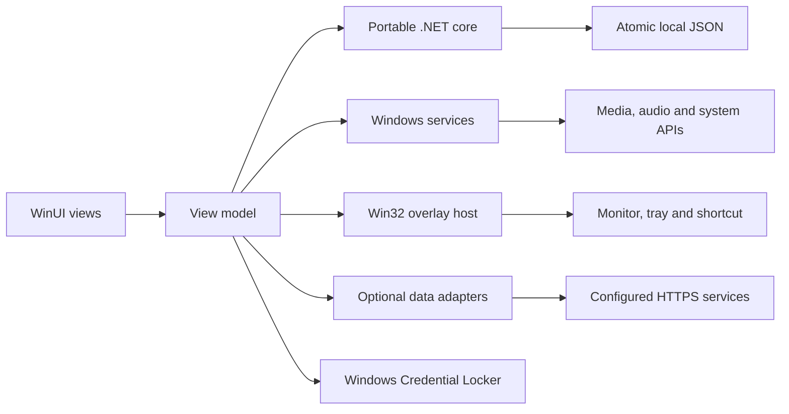

<p align="center">
  
</p>

<h1 align="center">Notch</h1>

<p align="center"><strong>Your music, focus, and everyday tools. A little closer.</strong></p>

<p align="center">A native Windows desktop companion built with C#, WinUI 3, and Windows App SDK.</p>

<p align="center">
  <a href="https://github.com/SuryaK999/Notch-win-linux/actions/workflows/build.yml"></a>
</p>

<p align="center">
  <a href="#the-experience">Experience</a> ·
  <a href="#free-and-premium">Pricing</a> ·
  <a href="#get-notch">Get Notch</a> ·
  <a href="#build-and-run">Development</a> ·
  <a href="#license">License</a>
</p>

Notch puts useful controls at the top of your display. A compact strip opens into a focused panel for what you need: change a track, start a focus session, keep a thought, reach a file, or check your system. A separate tool dock makes moving between tasks quick, and pinning keeps the current panel open.

Windows 10 and Windows 11 are equal release targets. The app uses native controls and Windows services; its portable .NET core also runs on Linux. A Linux desktop app is a later phase.

## Project status

**Notch is in active development.** The remediation source [builds and publishes in Windows CI](https://github.com/SuryaK999/Notch-win-linux/actions/runs/37180992149). This revision adds reliability repairs, Free/Premium enforcement, a configurable billing service, reproducible regression checks and signed-release tooling. Native Windows qualification, live commercial configuration and signing credentials are still required before public paid distribution.

| Area | Current state |
| --- | --- |
| Windows app | Native WinUI 3; Windows 10 22H2/build 19045 x64 and supported Windows 11 x64 releases are equal targets |
| Build and packaging | Review ZIP in CI; fail-closed signed per-user installer and stable release draft workflow |
| Shared core | Package-free functional fixtures plus checked-in simulated view-model and native source checks |
| Product plans | Release starts Free; Premium requires a signed proof from the configured service; **US$2/month** billing is inactive until owner setup |
| Linux | Shared core and tests work; desktop UI and Linux OS services are planned |
| Motion and performance | Native motion and reduced-motion paths; hardware frame-pacing/resource measurements remain required |

See the [latest workflow runs](https://github.com/SuryaK999/Notch-win-linux/actions/workflows/build.yml) and [validation evidence](docs/validation-notes.md) for results and their limits. A successful build establishes compilation and packaging; the [release matrix](docs/release-readiness.md) covers the desktop behavior still to verify.

## The experience

### Close when you need it

The notch stays compact at the top of the selected monitor. Hover to open, choose a tool from the dock, and leave to collapse. Pin a panel when you want it to stay. The tray provides Open, Settings, and Quit actions.

Editing and open dialogs are protected from passive hover navigation. Explicit keyboard and pointer actions remain available alongside hover controls.

| Action | Control |
| --- | --- |
| Open or collapse the notch | `Ctrl + Shift + Space` |
| Open Settings while the app has focus | `F2` |
| Collapse the current panel | `Esc`, when no dialog is open |
| Keep a panel open | Pin button |
| Move between controls | `Tab` / `Shift + Tab` |
| Change the monitor, hover behavior, or motion preference | Settings |
| Exit and release native resources | Tray → **Quit Notch** |

### Native, with focused boundaries

WinUI handles controls and content composition. Windows APIs handle media sessions, audio volume, monitor placement, shortcuts, the tray, and power requests. Views are created on demand; unrelated panels avoid repeated telemetry updates. Port scans run on a worker thread, and stopwatch ticks update their time label directly.

The architecture is designed to reduce unnecessary work. CPU, memory, input latency, and frame pacing still need measurement on Windows hardware; the project does not advertise unverified performance numbers.

## Tools

The development build contains **Home and 20 tools**, plus Settings and an All tools index. These are implemented surfaces with local, connected, empty, and unavailable states as appropriate. Release access follows the plans below. Debug builds visibly enable the catalog for development; that does not grant a subscription.

| Group | Tools | What they do |
| --- | --- | --- |
| At a glance | Home | Summarizes available local information and connected dashboards |
| Music | Media | Artwork, track information, playback, seeking where supported, and system volume |
| Focus | Focus, Sounds, Awake | Pomodoro, countdowns, stopwatch with laps, hydration reminders, local ambient sound, and intentional sleep inhibition |
| Capture and access | Notes, Scratchpad, Shelf, Files, Links, Clipboard, Emoji | Keep text close, save file references and links, and optionally retain recent copied text |
| Your desktop | System, Servers, Screen time, Convert | CPU, memory, battery, volume, listening ports, active session time, and unit conversions |
| Connected work | Revenue, Analytics, Coding, Calendar, Weather | Optional payment reports, site metrics, imported coding usage, calendar events, and forecasts |

The [module guide](docs/modules-and-connections.md) records each tool's exact behavior and boundaries.

### Optional connections

Local tools do not require a provider account. Connected tools use information you explicitly configure or import.

| Connection | Available implementation | Boundary |
| --- | --- | --- |
| Media | Windows system media sessions | Controls depend on the active player's capabilities |
| Revenue | Read-only Stripe captured payments, minus refunds | Payment totals are not subscription MRR; Polar, Dodo, and AdSense are not connected |
| Analytics | A user-configured HTTPS endpoint with a documented JSON contract | Requires an adapter endpoint; built-in provider OAuth and site tracking are not implemented |
| Coding | Explicit local Claude or Codex JSONL import | Reports imported usage, without scanning your home directory or inferring provider quotas |
| Calendar | Local `.ics` import and reminders | Supports documented recurrence and time-zone rules; Google/Outlook account sync is future work |
| Weather | Open-Meteo city lookup and forecasts | Production weather requires the authenticated, licensed backend proxy; no free public endpoint is silently used in Release |

See [provider contracts](src/Notch.Core/Providers/README.md) for schemas, supported input, attribution, and connection requirements. External provider accounts, charges, and service availability are separate from a Notch subscription.

## Free and Premium

Notch will use a simple monthly subscription model: a deliberately small **Free** edition and the full tool suite in **Premium for US$2 per month**.

| | Free | Premium |
| --- | --- | --- |
| Price | **$0** | **US$2/month**, billed monthly |
| Purpose | A few useful essentials | The complete Notch workspace |
| Compact notch, standard layout, keyboard access | Included | Included |
| Basic media transport | Play/pause, previous, next | Full media panel and supported playback controls |
| Focus | One Pomodoro timer | Pomodoro, countdowns, stopwatch/laps, and hydration |
| Quick capture | One local scratchpad | Scratchpad, notes, file shelf, shortcuts, and links |
| Extended utilities | — | Clipboard history, system tools, conversions, emoji, sounds, and Awake |
| Connected dashboards | — | Supported revenue, analytics, coding, calendar, and weather connections |
| Privacy controls and reduced motion | Included | Included |

**Commercial activation is pending owner setup.** Release builds enforce Free access until an RSA-signed Premium entitlement is verified. The checked-in service implements hosted Stripe checkout/portal, email verification, renewals and device-bound proofs. A production domain, Stripe price/secrets, email delivery, signing keys and customer-policy approval must be configured before charging. Debug builds visibly enable development access.

The intended subscription experience is monthly renewal, cancellation of future renewals, and Premium access through the paid period. Downgrade handling must preserve local data. The service paths and local access controls need live sandbox and native qualification before billing launches; there is no annual or lifetime offer.

The subscription supports ongoing product development. It does not include AI token allowances, paid third-party service plans, or a cloud synchronization service. The [pricing policy](docs/pricing.md) defines the boundaries; [billing setup](docs/billing.md) covers activation and verification.

## Privacy and local data

Notch's local workspace stays on your device. There is no app-owned synchronization backend in the current implementation.

- **Workspace:** notes, scratch text, reminders, links, and file references use local plaintext JSON under `%LOCALAPPDATA%\Notch`. Saves are atomic, bounded, and coordinated with readers.
- **Credentials:** provider secrets use Windows Credential Locker and are separate from workspace JSON.
- **Clipboard:** capture is off by default. Enabling it retains up to 50 text entries in memory; disabling it or quitting clears them.
- **Imports:** calendar and coding data come from files you choose explicitly.
- **Network:** connected tools contact their configured providers or analytics endpoint. Local tools do not require those connections.
- **Demo mode:** sample figures appear only when enabled and are labeled. They do not imply a connected account.

Local storage is plaintext, so device security and backups matter. Use Settings to export/restore a private workspace backup. Quit Notch before also copying the app-data folder. Windows vault credentials are not included in that folder. An unreadable notebook is preserved; Settings offers recovery and export. Failed final saves keep the app open for retry, export or explicit discard.

Storage limits protect responsiveness and recoverability: a 10 MB serialized file limit, up to 100 notes/reminders/file-shelf entries/links per collection, and bounded text lengths. Premium is not advertised as unlimited storage.

## Get Notch

### Development builds

Open [GitHub Actions](https://github.com/SuryaK999/Notch-win-linux/actions/workflows/build.yml), choose a successful run, and download **`notch-windows-x64-unpackaged`** from its artifacts. GitHub may require sign-in to download artifacts.

Extract the archive and keep the complete application folder together. Run `Notch.Windows.exe` on a compatible Windows machine. The self-contained package includes its runtimes; an end-user SDK installation is not required by the packaging configuration. Clean-machine launch remains part of release QA.

These unsigned artifacts are evaluation builds. The [signed release workflow](.github/workflows/release.yml) prepares a per-user installer, notices/SBOM, checksum manifest and reviewable GitHub release draft. It requires publisher credentials and refuses unsigned public-release output. Stable downloads appear under [Releases](https://github.com/SuryaK999/Notch-win-linux/releases) after native and commercial release gates are complete.

### Platform support

| Platform | Support |
| --- | --- |
| Windows 10 22H2 x64 | Build 19045; equal release target, native qualification required |
| Windows 11 x64 | Supported release builds selected at launch; equal release target, native qualification required |
| Windows ARM64 | No release target currently configured |
| Linux | Portable core and tests; native desktop application planned later |
| macOS | No application target currently configured |

## Build and run

### Windows prerequisites

Use Windows 10 22H2 x64 or Windows 11 x64 with a stable .NET 10 SDK, the Windows SDK, and the WinUI/C# desktop build tools supplied by Visual Studio 2026 or current Visual Studio Build Tools. Restore needs access to NuGet.

The repository pins SDK **10.0.100** with compatible feature-band roll-forward in [global.json](global.json). The desktop project pins **Windows App SDK 1.8.260921001**. CI installs a stable .NET 10 SDK and builds the x64 target.

```powershell
git clone https://github.com/SuryaK999/Notch-win-linux.git
cd Notch-win-linux

dotnet restore src/Notch.Windows/Notch.Windows.csproj -p:Platform=x64
dotnet build src/Notch.Windows/Notch.Windows.csproj --configuration Release -p:Platform=x64
dotnet run --project src/Notch.Windows/Notch.Windows.csproj --configuration Debug -p:Platform=x64
```

Debug is visibly labeled and exposes the development catalog. Use Release to verify Free defaults and signed subscription access.

### Publish a self-contained folder

```powershell
dotnet publish src/Notch.Windows/Notch.Windows.csproj --configuration Release --runtime win-x64 --self-contained true -p:Platform=x64 -p:WindowsPackageType=None -p:WindowsAppSDKSelfContained=true -p:PublishSingleFile=false --output artifacts/notch-windows-x64
```

Publish produces a folder containing the app and its dependencies. Keep that folder intact. The [build workflow](.github/workflows/build.yml) includes publisher notices/SBOM and a ZIP for review. [Release delivery](docs/release-delivery.md) describes signed installer preparation and verified updates; production activation remains separate.

### Shared core on Windows or Linux

```bash
dotnet run --project tests/Notch.Core.Tests/Notch.Core.Tests.csproj --configuration Release
```

The package-free test runner reports the executed/passed/failed counts and returns a nonzero exit code on failures or an empty test suite. It uses `dotnet run`; external test-runner packages and live provider credentials are not required.

Convenience scripts: [PowerShell checks](scripts/check-core.ps1) and [Bash checks](scripts/check-core.sh).

<details>
<summary>Optional user-local SDK installation</summary>

The optional [SDK bootstrap](scripts/install-dotnet.py) reads the repository pin, downloads official Microsoft release metadata over HTTPS, and verifies the SDK archive with SHA-512 before extraction. It requires Python 3.11.8 or newer.

From the repository root, install into ignored local directories:

```bash
python3 scripts/install-dotnet.py --install-dir .tools/dotnet --cache-dir .tools/downloads
NOTCH_DOTNET="$PWD/.tools/dotnet/dotnet" ./scripts/check-core.sh
```

Use your normal .NET installation or choose local bootstrap paths. The Windows XAML compiler and desktop services require Windows; a Linux core build does not launch the Windows app.

</details>

## Architecture



| Component | Responsibility |
| --- | --- |
| `Notch.Core` | Typed models, tool catalog, timers, navigation state, storage, conversions, and provider/import contracts |
| `Notch.Windows` | WinUI presentation, native overlay host, Windows services, credentials, tray, and keyboard integration |
| `Notch.Core.Tests` | Functional fixtures for portable behavior, persistence, commerce proofs and provider validation |
| `Notch.ViewModel.Tests` | Actual linked view model with deterministic simulated native services; Debug lifecycle and Release Free-plan checks |
| `Notch.Native.SourceChecks` | Regenerated XAML projections and native C# compilation; no native UI execution |
| `Notch.Billing` | Configurable server-only Stripe/email/entitlement/weather service; never runs inside the desktop app |

One desktop process hosts the application. Native events enter through the UI dispatcher; slow work is asynchronous or moved off the UI thread. Newer requests invalidate stale results, and shutdown waits for active writes. There is no application web server or browser-hosted UI. The Windows SDK dependency graph includes vendor components beyond the features Notch actively uses; see [third-party notices](THIRD_PARTY_NOTICES.md).

The [architecture guide](docs/architecture.md) covers lifetime, refresh scheduling, privacy boundaries, and storage behavior in more detail.

## Quality and release work

CI runs the portable checks on Windows and Linux, then builds and publishes the native Windows application. Local fixtures cover cancellation, concurrent storage, Unicode, timer gaps, activity queues, payment pagination and currency precision, calendar recurrence/DST, and malformed provider data.

Before commercial distribution, the application still needs:

1. Qualify the same signed artifact separately on Windows 10 and Windows 11, including accessibility, DPI, monitors and sleep/resume.
2. Measure CPU, memory, input latency and rendered frame pacing on modest Windows hardware.
3. Configure signing, review the generated notice/SBOM inventory, and verify clean install, upgrade, interruption and uninstall.
4. Configure the production billing/email service and licensed weather proxy; exercise live sandbox lifecycle cases.
5. Approve publisher identity, privacy, tax, cancellation/refund and private support disclosures before accepting payment.

For a basic Windows resource sample:

```powershell
./scripts/measure-windows.ps1 -ProcessName Notch.Windows -Seconds 60
```

This records CPU, memory, and handle samples. Rendered frame pacing requires separate Windows profiling. Acceptance cases are in [release readiness](docs/release-readiness.md).

## Roadmap

| Phase | Focus |
| --- | --- |
| Windows foundation | Native controls, useful local tools, dependable storage, and truthful connection states |
| Windows refinement | Layout, motion, accessibility, monitor behavior, performance, and real-provider QA |
| Commercial release | Signed distribution and the Free / US$2-per-month Premium offering |
| Expanded connections | Additional providers and calendar account integrations where practical |
| Linux desktop | A native presentation and Linux service adapters, validated separately on X11 and Wayland |

See the [product roadmap](docs/product-roadmap.md) for sequencing. Cloud sync, broader integrations, and other future capabilities are not included promises in the current Premium offering.

## Contributing and support

Report reproducible issues through [GitHub Issues](https://github.com/SuryaK999/Notch-win-linux/issues). Include the Windows build, app revision, affected module, and steps to reproduce. Remove credentials and private content from logs or screenshots.

For a contribution, discuss larger changes before opening a pull request, keep changes focused, and run the relevant checks. Source use and contribution rights are governed by [LICENSE](LICENSE); commercial redistribution requires permission from the maintainer.

## License

Copyright © 2026 **SuryaK999**. Notch's original source is distributed under the [Notch Source-Available Commercial License](LICENSE). It permits local evaluation, development, research, and upstream contributions, subject to its terms. Commercial distribution, resale, and production deployment of source-built versions require separate permission.

Official product releases carry [product terms](docs/product-terms.md), [privacy](docs/privacy.md) and [support](docs/support.md). The current commercial-policy draft still needs the publisher’s legal identity and approval before charging. A planned **US$2/month** subscription grants product access after verified purchase on the configured service; it does not grant source redistribution rights. Third-party components retain their own licenses, recorded in [THIRD_PARTY_NOTICES.md](THIRD_PARTY_NOTICES.md).

## Documentation

| Guide | Contents |
| --- | --- |
| [Design principles](docs/design-principles.md) | Visual language, interaction behavior, and motion direction |
| [Architecture](docs/architecture.md) | Core/UI separation, native services, scheduling, and persistence |
| [Modules and connections](docs/modules-and-connections.md) | Tool behavior, configuration, and supported integration boundaries |
| [Pricing policy](docs/pricing.md) | Free essentials, Premium scope, and subscription requirements |
| [Product roadmap](docs/product-roadmap.md) | Windows release sequence and later Linux work |
| [Validation evidence](docs/validation-notes.md) | Actual test/build results and unverified runtime areas |
| [Release readiness](docs/release-readiness.md) | Desktop QA, performance, packaging, and billing acceptance |
| [Provider contracts](src/Notch.Core/Providers/README.md) | API schemas, units, imports, and provider requirements |
| [Windows support](docs/windows-support.md) | Equal Windows 10/11 baselines and qualification boundaries |
| [Native qualification](docs/native-qualification.md) | Reproducible interactive checklist and evidence template |
| [Release delivery](docs/release-delivery.md) | Signed installer, stable channel, integrity, rollback and notices |
| [Billing setup](docs/billing.md) | Server and desktop public configuration, secrets and sandbox checks |
| [Product terms](docs/product-terms.md) | Application rights, recurring charges, cancellation and draft refunds |
| [Privacy](docs/privacy.md) | Local data, optional requests and customer controls |
| [Support](docs/support.md) | Safe issue reporting and commercial owner requirements |
