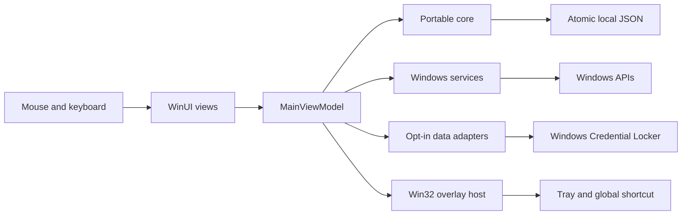

# Architecture

`Notch.Core` contains typed records, the tool catalog, clock-driven focus timers, the overlay state machine, bounded atomic local storage, unit conversions and explicit provider/import adapters. It is a package-free .NET library with no reference to WinUI or Windows APIs. Its tests run on Linux and Windows.

`Notch.Windows` is the Windows application. WinUI owns native controls and content composition. Win32 owns monitor placement, window regions, the tray and the global shortcut. GSMTC supplies event-driven media state; Core Audio supplies volume; lightweight native calls supply system data and session-only screen time. A thread dedicated to the Awake request restores normal power behavior on disposal.

The view model is the integration boundary. Native events enter through the UI dispatcher. Heavy or asynchronous operations expose cancellation and errors. Newer requests invalidate older responses so a late network result cannot overwrite a new selection or explicit demo state. A broken optional import does not prevent local timers and other tools from starting.

Views are created on demand and detached from the content host while the notch is collapsed. Native system snapshots are read for the relevant visible panels; unrelated views do not rebuild for every system update. Stopwatch display updates run only when that tool is visible. The tiny session screen-time sampler is separate from UI rendering. Weather uses a retained adapter with a cache. External services do not require an always-running polling backend.

TCP listener enumeration runs on a worker thread only while Home or Servers is visible. Unchanged lists do not notify the views, and navigation invalidates late scan results. Stopwatch ticks update only the time label; lap tooltips update when laps change, and focus arc geometry is retained while progress is unchanged. These choices remove avoidable UI work without claiming a measured Windows frame rate.

Notes, scratchpad, reminders, links and shelf references are local plaintext workspace data. Accepted edits are checked against text and serialized-size limits; a failed final write keeps the app available for retry, export or explicit discard. Writes replace an existing file atomically only after successful bounded serialization. The same 10 MB serialized-size limit applies to writes and reads. A corrupt notebook is retained and its autosave is disabled until recovery, rather than being replaced with an empty workspace. Provider credentials are kept separately in Windows Credential Locker. Clipboard capture is off by default and memory-only when enabled.

One asynchronous storage gate coordinates readers and writers within the app. A reader closes its handle before the next atomic replacement; this avoids Windows file-replacement access failures. File streams use asynchronous I/O, and the storage layer does not capture the UI synchronization context.

The desktop does not embed a browser or billing server. The optional `Notch.Billing` service is a separately deployed owner-operated HTTPS service; only public service configuration and signed entitlement proofs enter the desktop. Those mechanisms are unnecessary for the local interaction model. A future Linux interface can reuse the core and adapter contracts, while replacing the presentation and native service implementations.

Content animation runs through the compositor. The native host owns panel-size transitions and reduced-motion behavior. Rendered smoothness remains a Windows qualification requirement. CPU, memory, startup time, input latency and long-running resource use must be measured on real Windows hardware using the release matrix. Framework choice alone is not a performance result.
