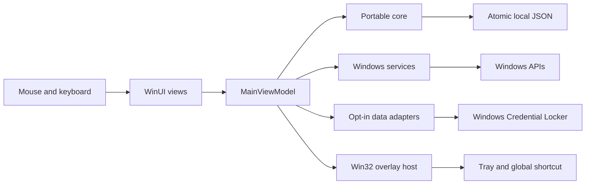

# Architecture

Notchling separates native presentation, operating-system services, portable behavior, and optional commercial services. The desktop remains one process; local tools do not depend on the billing server.

`Notch.Core` contains typed records, the tool catalog, clock-driven focus timers, the overlay state machine, bounded atomic local storage, unit conversions and explicit provider/import adapters. It is a package-free .NET library with no reference to WinUI or Windows APIs. Its tests run on Linux and Windows.

`Notch.Windows` is the Windows application project and emits `Notchling.Windows.exe` / `Notchling.Windows.dll`. Its namespace and source paths remain stable. WinUI owns native controls and content composition. Win32 owns monitor placement, window regions, the tray and the global shortcut. GSMTC supplies event-driven media state; Core Audio supplies volume; lightweight native calls supply system data and session-only screen time. A thread dedicated to the Awake request restores normal power behavior on disposal.

The view model is the integration boundary. Native events enter through the UI dispatcher. Heavy or asynchronous operations expose cancellation and errors. Newer requests invalidate older responses so a late network result cannot overwrite a new selection or explicit demo state. A broken optional import does not prevent local timers and other tools from starting.

Views are created on demand and detached from the content host while the notch is collapsed. Native system snapshots are read for the relevant visible panels; unrelated views do not rebuild for every system update. Stopwatch display updates run only when that tool is visible. The tiny session screen-time sampler is separate from UI rendering. Weather uses a retained adapter with a cache. External services do not require an always-running polling backend.

TCP listener enumeration runs on a worker thread only while Home or Servers is visible. Unchanged lists do not notify the views, and navigation invalidates late scan results. Stopwatch ticks update only the time label; lap tooltips update when laps change, and focus arc geometry is retained while progress is unchanged. These choices remove avoidable UI work without claiming a measured Windows frame rate.

Notes, scratchpad, reminders, links and shelf references are local plaintext workspace data. Accepted edits are checked against text and serialized-size limits; a failed final write keeps the app available for retry, export or explicit discard. Writes replace an existing file atomically only after successful bounded serialization. The same 10 MB serialized-size limit applies to writes and reads. A corrupt notebook is retained and its autosave is disabled until recovery, rather than being replaced with an empty workspace. Provider credentials are kept separately in Windows Credential Locker. Clipboard capture is off by default and memory-only when enabled.

One asynchronous storage gate coordinates readers and writers within the app. A reader closes its handle before the next atomic replacement; this avoids Windows file-replacement access failures. File streams use asynchronous I/O, and the storage layer does not capture the UI synchronization context.

The branding update retains `%LOCALAPPDATA%\Notch`, existing Credential Locker identities, the single-instance/application mutexes, and the installer identity. Changing the displayed brand and executable name does not reset a workspace or sever purchase restoration. Source namespaces and the repository URL are implementation identities, separate from the product's displayed name.

The desktop does not embed a browser or billing server. The optional `Notch.Billing` service is a separately deployed owner-operated HTTPS service; only public service configuration and signed entitlement proofs enter the desktop. Those mechanisms are unnecessary for the local interaction model. A future Linux interface can reuse the core and adapter contracts, while replacing the presentation and native service implementations.

Content animation runs through the compositor. The native host owns panel-size transitions and reduced-motion behavior. Rendered smoothness remains a Windows qualification requirement. CPU, memory, startup time, input latency and long-running resource use must be measured on real Windows hardware using the release matrix. Framework choice alone is not a performance result.

## v0.4.12 source refinements

These changes describe the current candidate; the published v0.3.4 evidence remains separate in [validation](validation-notes.md).

Control icons cache immutable 24-unit path tokens and create a fresh WinUI geometry for each control. This preserves a consistent stroke without sharing a WinUI dependency object between different Paths. Semantic icon kinds separate tool meaning from the rendering implementation. Brand/source icons use a separate component, and unknown registered players can retain their Windows-supplied logo.

`MediaSourceIdentity` resolves only the identity Windows actually supplies. A generic browser session does not reveal its tab URL. A temporary provider choice contains the source, title, artist, album and native session revision; it clears when that fingerprint changes. The native media service advances the revision when the active session object changes, so a new session with identical track text cannot inherit an old choice. Artwork and timeline updates within one track preserve the choice. Compact playback renders the source icon; expanded Media keeps its cover/thumbnail separately.

The overlay interpolates from its current native geometry when a transition reverses. Distance-dependent durations range from 110 to 180 ms; short interruptions settle sooner. Content uses opacity and small compositor translations without scaling text. Native window regions, visible dock boundaries and hit testing share the current geometry. Application reduced motion or disabled Windows animations settle the host and content immediately, including an interrupted animation. These are implementation choices, not frame-pacing measurements.

Feedback is scoped to the selected tool and expires after eight seconds using a monotonic clock. Unsaved-work guidance is retained. Update discovery is separated from verified installation through `IWindowsUpdateService`: one cancellable operation owns a linked lifetime token, late callbacks are fenced, and disposal waits for that work before releasing the HTTP client. Discovery adds a bounded history notice and compact indicator without enqueueing an activity that could replace an editor.

The optional update scheduler runs through the existing app tick, checks at most every 24 hours within a session, and is disabled by default. It does no work in preview or after disposal. Evaluation discovery reads official release metadata; only an explicit install action in a trusted signed release may download and open a verified installer. Schema-2 manifests carry separate x64, x86 and ARM64 assets, selected for the running app's process architecture. Legacy schema-1 manifests remain x64-only.

Packaging accepts matched x64/x86/ARM64 platform and runtime identifiers. Setup checks app-architecture .NET, app-architecture Windows App Runtime Framework/DDLM, and native-host Main/Singleton packages; a cross-architecture install also requires the native framework dependency. Microsoft-signed resource recovery follows that plan and validates package manifests before deployment. Package audits inspect PE headers and bootstrapper/runtime configuration; installed qualification records the actual process architecture.

The v0.4.12 candidate also moves the signed-resource reader's AnyCPU compilation into the build. Setup packages that helper for prerequisite work; it does not add a compiler dependency or helper process to the running app. Translation targets the WinUI visual's property set. The v0.4.8 run passed actual installation, matching-architecture launch and hover cycles on all four hosts, then stopped at Settings bounds before the remaining UI assertions. The follow-up bounds check recognizes only typed tooltip surfaces and their related hosts/children, requires them to fit the monitor work area, and retains strict panel bounds for other content. Exact stages are recorded in [validation](validation-notes.md#candidate-qualification-sequence--10-october-2026-utc).
